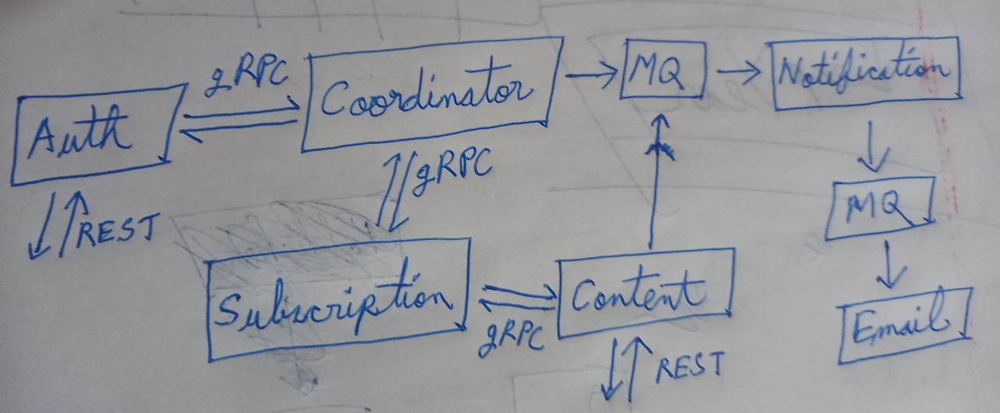

# TinyLetter

TinyLetter is a microservices-based scalable newsletter infrastructure designed to streamline the process of creating, managing, and delivering newsletters to subscribers. The project leverages a distributed architecture to ensure modularity, scalability, and ease of maintenance.

---

## **Architecture Overview**

### **Microservices**

1. **User Service**
   - Handles user registration and login.
   - Manages user roles and permissions.
   - Communicates with Subscription Service via gRPC for publisher onboarding.

2. **Content Service**
   - Manages publications and posts.
   - Publishes messages to RabbitMQ when new posts are created.

3. **Subscription Service**
   - Manages subscriptions for publishers and subscribers.
   - Provides APIs for retrieving subscribers for a given publication.

4. **Notification Service**
   - Consumes messages from RabbitMQ.
   - Identifies the target audience by querying Subscription Service.
   - Sends tasks to the Email Service for email dispatch.
    - **Why is it needed?**  
     If a user wants to receive notifications via WhatsApp or other channels, the Notification Service will handle it.  

5. **Email Service**
   - Handles rate-limiting.
   - Sends emails to subscribers.

6. **Coordinator Service**
   - Coordinates between User Service, Subscription Service, and Email Service to ensure consistency via 2PC.
   - Handles subscription, unsubscription, and plan change requests.

---

### **Diagram**



---

## **Tech Stack**

- **Programming Language**: Go (Golang)
- **Database**: PostgreSQL
- **Message Queue**: RabbitMQ
- **Authentication**: JWT
- **Containerization**: Docker
- **Orchestration**: Kubernetes (Minikube for local testing)
- **API Gateway**: Traefik or Kong (optional)

---

## **Database Design**

### **Tables**

1. **Roles**
   - `id`, `name`

2. **Users**
   - `id`, `name`, `email`, `password`

3. **User Roles**
   - `user_id`, `role_id`

4. **Publications**
   - `id`, `publisher_id`, `created_at`, `updated_at`

5. **Posts**
   - `id`, `publication_id`, `title`, `content`, `is_premium`, `created_at`, `updated_at`

6. **Publisher Subscription Plans**
   - `id`, `name`, `order`

7. **Publisher Subscriptions**
   - `user_id`, `plan_id`

8. **Subscriber Subscriptions**
   - `user_id`, `is_premium`, `publication_id`

9. **Audience Limits**
   - `plan_id`, `size`

10. **Permissions**
    - `name`, `plan_id`

---

## **Getting Started**

### **Prerequisites**

- [Go](https://golang.org/)
- [Docker](https://www.docker.com/)
- [Minikube](https://minikube.sigs.k8s.io/docs/)
- [RabbitMQ](https://www.rabbitmq.com/)

### **Setup Instructions**

1. Clone the repository:
   ```bash
   git clone https://github.com/nahK994/tiny-letter.git
   cd tiny-letter
   ```

2. Start DB using Docker Compose:
   ```bash
   docker compose -f db.yml up -d
   ```

3. Run services locally:
   ```bash
   // Will be updated soon
   ```

---

## **Contributing**

Contributions are welcome! Please open an issue or submit a pull request on the [GitHub repository](https://github.com/nahK994/TinyLetter).

---

## **License**

This project is licensed under the MIT License - see the [LICENSE](LICENSE) file for details.

---

## **Contact**

For any inquiries, please contact **Shomi Khan** at [nkskl6@gmail.com](mailto:nkskl6@gmail.com).
